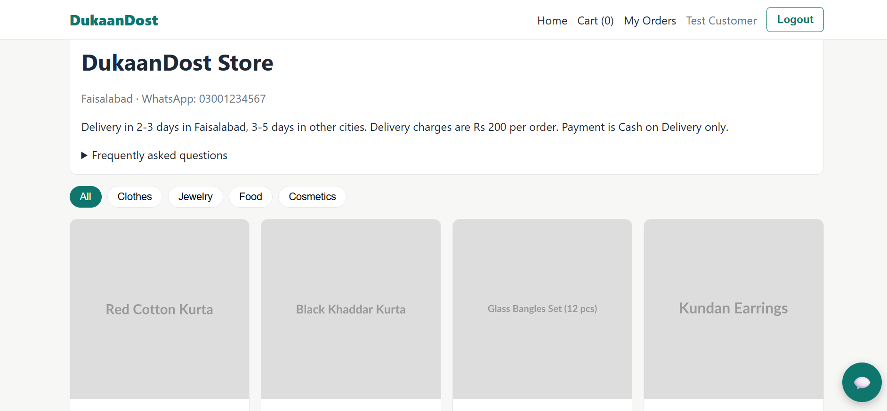
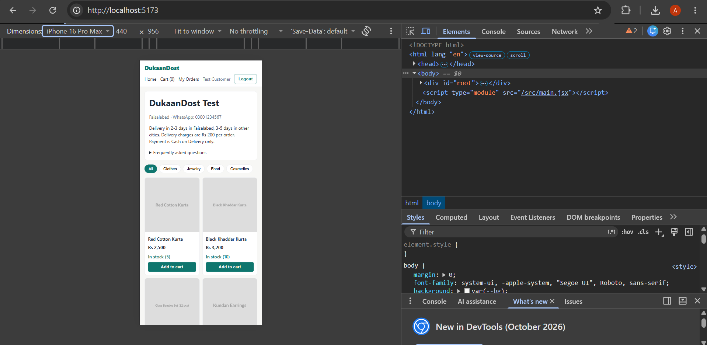
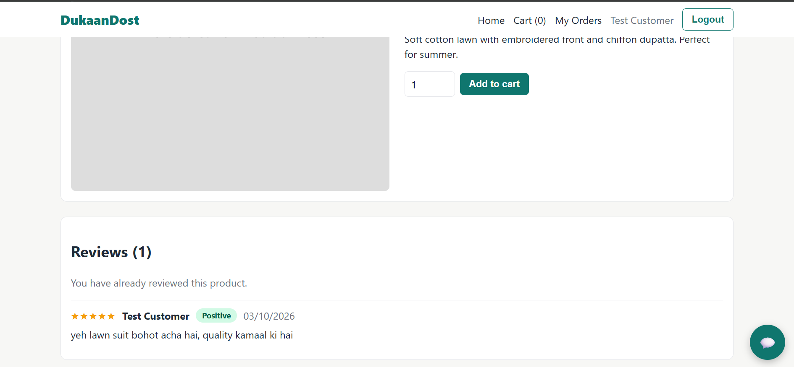
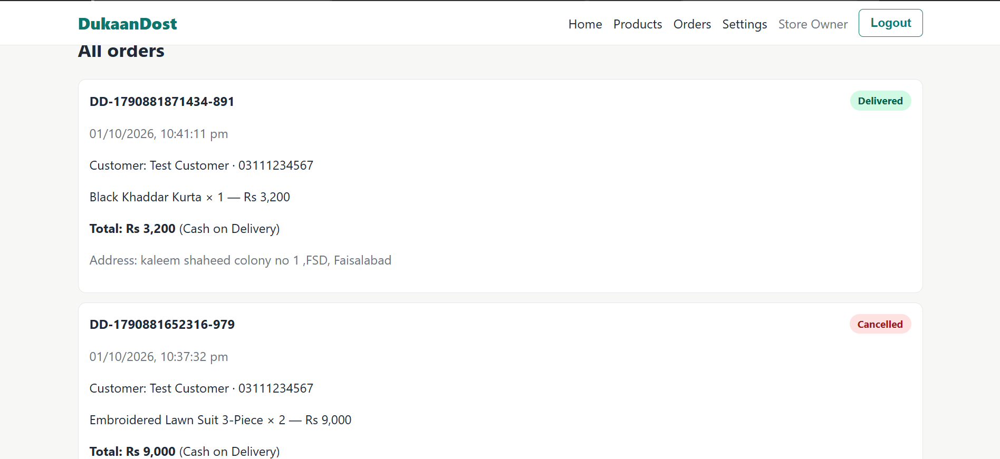

# DukaanDost Lite — Amna Butt (2023-ag-10373, BSSE7E2)

A full-stack online store for one small Pakistani business, with an AI assistant that answers customer questions in English, Urdu and Roman Urdu, and review sentiment analysis.

## 1. Tech Stack

- **Frontend:** React (Vite), React Router, Axios, plain CSS
- **Backend:** Node.js, Express.js
- **Database:** MongoDB (Atlas) with Mongoose
- **Authentication:** JWT and bcrypt (built from scratch, no auth service)
- **LLM:** Google Gemini (`gemini-3.5-flash-lite`), called only from the backend
- **Hugging Face:** `cardiffnlp/twitter-xlm-roberta-base-sentiment` through the Inference API

## 2. Features Implemented

| ID | Feature | Status |
|----|---------|--------|
| F01 | Authentication and Roles | Done |
| F02 | Products and Store Settings | Done |
| F03 | Storefront, Cart and Checkout | Done |
| F04 | Order Management | Done |
| F05 | AI Store Assistant (LLM) | Done |
| F06 | Reviews and Sentiment Analysis (Hugging Face) | Done |

Bonus features: none.

## 3. AI Features and Models Used

**AI Store Assistant (F05).** A chat widget on the storefront sends the new message and the last 10 messages to `POST /api/chat`. For every message the backend loads the products (title, price, stock, category, short description) and the store settings (city, WhatsApp number, delivery policy, FAQs) from the database and puts them into the system prompt. The assistant replies in the language of the customer (English, Urdu or Roman Urdu), does not invent products or prices, sends the customer to the store's WhatsApp number when it does not know, and refuses questions that are not about the store. The LLM API key is only in `backend/.env`, and the call is wrapped in `try/catch` with a friendly error message. All prompts are in `docs/ai-prompts.md`. Code: `backend/src/services/ai/`.

**Review sentiment (F06).** When a customer with a Delivered order submits a review, the backend sends the text to the Hugging Face model `cardiffnlp/twitter-xlm-roberta-base-sentiment` (multilingual sentiment) through the Inference API. The label with the highest score (positive, neutral or negative) is saved with the review. The product page shows a sentiment badge on each review, and the seller sees the counts on the Reviews page. If the model fails, the review is saved as neutral.

## 4. How to Run Locally

Requirements: Node.js 18 or newer and a MongoDB connection string (for example a free MongoDB Atlas cluster).

**Backend**

```bash
cd backend
cp .env.example .env      # on Windows: copy .env.example .env
# open .env and fill in the values (see section 5)
npm install
npm run seed
npm run dev
```

The backend runs on http://localhost:5000.

**Frontend** (in a second terminal)

```bash
cd frontend
npm install
npm run dev
```

Open http://localhost:5173 in the browser.

## 5. Environment Variables

**backend/.env**

| Variable | Purpose |
|----------|---------|
| `PORT` | Port of the backend server (for example 5000) |
| `MONGO_URI` | MongoDB connection string |
| `JWT_SECRET` | Secret used to sign login tokens |
| `CLIENT_URL` | Frontend address allowed by CORS (http://localhost:5173) |
| `LLM_API_KEY` | Google Gemini API key |
| `LLM_MODEL` | Gemini model name (`gemini-3.5-flash-lite`) |
| `HF_TOKEN` | Hugging Face access token for the sentiment model |

**frontend/.env** (optional)

| Variable | Purpose |
|----------|---------|
| `VITE_API_URL` | Backend API address. If empty, http://localhost:5000/api is used |

## 6. Test Accounts

`npm run seed` creates these accounts, store settings with 4 FAQs, 9 products and one Delivered order for the customer.

| Role | Email | Password |
|------|-------|----------|
| Seller | seller@test.com | Test@1234 |
| Customer | customer@test.com | Test@1234 |

## 7. API Endpoints

The full list with request bodies and example responses is in [docs/api-docs.md](docs/api-docs.md).

## 8. Screenshots

**Storefront (home page)**



**Storefront on mobile**



**AI assistant answering in Roman Urdu**


**Product reviews with sentiment badges**



**Seller orders page**



## 9. Demo Video

https://drive.google.com/file/d/1Ds8F_fal_qPU49LOVlzpXztI6pV9u1ji/view

## 10. AI Tools Used During Development

- **Claude (Anthropic):** I used it as an assistant while building the project. It helped me plan the steps, write and debug code for the backend, frontend and AI integration, and explained how the parts work. I set up MongoDB Atlas and the Gemini and Hugging Face keys myself, ran and tested the project on my laptop, and took the screenshots.

## 11. Known Issues and Limitations

- The sentiment model sometimes labels short Roman Urdu reviews wrongly (for example a neutral review marked negative).
- If the Hugging Face model is unavailable, the review is saved as neutral.
- The AI assistant uses a free-tier LLM. It can be rate limited, and then a friendly error message is shown.
- Product images are added as image URLs. File upload is not implemented.
- A customer can review each product only once.
